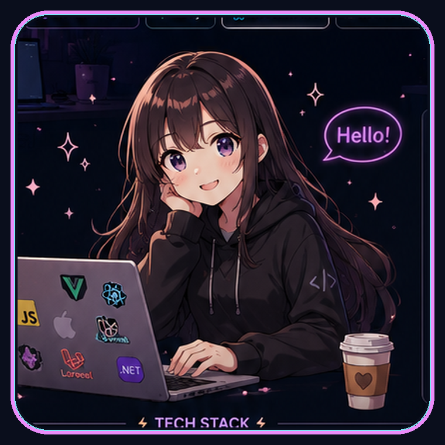
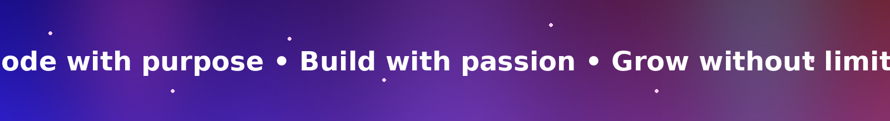

<div align="center">

# Hi, I'm Thae Shwe Sin 👋

### Full-Stack Developer


<br/>



<br/><br/>

<a href="https://www.linkedin.com/in/thae-shwe-sin-2a6a90368/">
  
</a>

<a href="mailto:thaeshwesin2000@gmail.com">
  
</a>

<a href="https://github.com/thaeshwesin29">
  
</a>

<br/><br/>


</div>

<br/>

<div align="center">

## ✦ Welcome to My Developer World ✦

</div>

I am a **Full-Stack Developer from Myanmar** who enjoys building secure, scalable, and user-friendly digital products.

My main experience is in **Laravel, Vue.js, JavaScript, PHP, and MySQL**. I am currently strengthening my backend skills with **ASP.NET Core** and learning **React Native** for cross-platform mobile development.

I enjoy transforming business ideas into reliable applications with clean architecture, reusable components, secure APIs, and professional user interfaces.

<table>
<tr>
<td width="50%" valign="top">

### 🌸 Developer Profile

```yaml
name: Thae Shwe Sin
location: Myanmar

roles:
  - Full-Stack Developer
  - Backend Developer

main_stack:
  - Laravel
  - Vue.js
  - PHP
  - MySQL

currently_learning:
  - ASP.NET Core
  - React Native

interests:
  - Clean Architecture
  - System Design
  - Cloud and DevOps
```

</td>

<td width="50%" valign="top">

### ✨ What I Build

- Full-stack web applications
- React Native practice projects while learning mobile development
- Secure RESTful APIs
- Admin and financial dashboards
- E-commerce platforms
- Booking and mentoring systems
- Wallet and payment workflows
- Authentication and authorization
- Responsive user interfaces
- Database-driven applications

</td>
</tr>
</table>

---

<div align="center">

## ⚔️ My Technology Arsenal

### Languages


<br/><br/>

### Frontend


<br/><br/>

### Mobile Development — Currently Learning


<br/>


<br/><br/>

### Backend


<br/><br/>

### Databases and Caching


<br/><br/>

### DevOps and Cloud


<br/><br/>

### Tools


</div>

---

<div align="center">

## 🌙 My Development Universe

</div>

<table>
<tr>

<td width="50%" valign="top">

### 🌐 Web Development

- Responsive web applications
- Vue.js component architecture
- React component fundamentals
- Tailwind CSS and Bootstrap
- Form validation and error handling
- REST API integration
- Authentication interfaces
- Mobile-first design
- Reusable UI components
- Performance optimization

</td>

<td width="50%" valign="top">

### 📱 Mobile Development — Learning

- React Native fundamentals
- Expo development workflow
- Cross-platform Android and iOS concepts
- Mobile navigation basics
- Reusable mobile components
- REST API integration
- Mobile authentication flows
- Form handling and validation
- Responsive mobile layouts
- Mobile debugging and testing basics

</td>

</tr>

<tr>

<td width="50%" valign="top">

### ⚙️ Backend Engineering

- Laravel application development
- ASP.NET Core Web API fundamentals
- RESTful API design
- Business logic implementation
- Authentication and authorization
- Service-repository pattern
- Request validation
- Exception handling
- Background processing concepts
- Secure backend architecture

</td>

<td width="50%" valign="top">

### 🗄️ Database Engineering

- MySQL and PostgreSQL
- MongoDB fundamentals
- Relational database design
- Entity relationships
- Database migrations
- Transactions and data integrity
- Query optimization
- Indexing fundamentals
- Redis caching concepts
- Financial data consistency

</td>

</tr>
</table>

---

<div align="center">

## 🏯 Architecture and Engineering Principles

</div>

```text
┌──────────────────────────────────────────────────────────┐
│                   APPLICATION DESIGN                     │
├──────────────────────────────────────────────────────────┤
│  Clean Code              Separation of Concerns          │
│  Reusable Components     Service-Repository Pattern      │
│  Modular Architecture    Domain-Driven Design            │
│  Secure REST APIs        Scalable System Design          │
└──────────────────────────────────────────────────────────┘

┌──────────────────────────────────────────────────────────┐
│                 SECURITY AND RELIABILITY                 │
├──────────────────────────────────────────────────────────┤
│  Authentication          Role-Based Authorization        │
│  Input Validation        CSRF Protection                 │
│  Database Transactions   Exception Handling              │
│  Secure Cookies          Data Integrity                  │
└──────────────────────────────────────────────────────────┘

┌──────────────────────────────────────────────────────────┐
│                 PERFORMANCE AND DELIVERY                 │
├──────────────────────────────────────────────────────────┤
│  Query Optimization      Redis Caching                   │
│  Lazy Loading            Docker Environments             │
│  Git Workflows           Nginx Configuration             │
│  API Testing             Cloud Deployment                │
└──────────────────────────────────────────────────────────┘
```

---

<div align="center">

## 🦋 Featured Project

### MentorLink


</div>

<br/>

**MentorLink** is a full-stack mentoring and booking platform that connects students with professional mentors through one-to-one sessions and group classes.

<table>
<tr>

<td width="50%" valign="top">

### 🌸 User Features

- Student and mentor accounts
- Mentor search and filtering
- Mentor profiles and skills
- One-to-one session booking
- Group class booking
- Availability scheduling
- Real-time messaging
- Video session integration
- Ratings and reviews
- User notifications

</td>

<td width="50%" valign="top">

### ⚡ Financial Features

- Wallet top-up system
- Booking balance reservation
- Secure wallet transactions
- Mentor earnings
- Student and mentor withdrawals
- Platform revenue tracking
- Financial administration
- Settlement workflows
- Transaction history
- Financial reporting

</td>

</tr>

<tr>

<td width="50%" valign="top">

### 🛡️ Technical Features

- PHP and MySQL backend
- Domain-driven design concepts
- Modular monolith architecture
- Role-based authorization
- Database transactions
- Clean separation of concerns
- Docker development environment
- Redis caching concepts

</td>

<td width="50%" valign="top">

### 🚀 Future Development

- React Native mobile application
- Advanced notification system
- Recommendation system
- AI-powered mentor matching
- Cloud deployment
- Automated testing
- Monitoring and logging
- Queue-based processing

</td>

</tr>
</table>

---

<div align="center">

## 🌌 Currently Exploring


</div>

<br/>

- ASP.NET Core Web API development
- React Native application architecture fundamentals
- Expo and mobile development workflows
- Mobile authentication and API integration
- Domain-driven design
- Modular monolith architecture
- High-level and low-level system design
- Redis caching and queue processing
- Docker and cloud deployment
- Monitoring and structured logging

---

<div align="center">

## 📊 GitHub Journey


<br/><br/>


<br/><br/>


</div>

---

<div align="center">

## 💫 My Developer Quest

</div>

- Build secure and scalable real-world applications
- Become a stronger full-stack and backend developer
- Build strong React Native mobile development skills
- Improve my ASP.NET Core backend knowledge
- Improve system design and software architecture skills
- Learn cloud deployment and DevOps practices
- Contribute to professional development teams
- Continue learning through practical projects

---

<div align="center">

## 🌸 Let’s Create Something Amazing

I am open to connecting with developers, mentors, recruiters, and engineering teams working on meaningful software products.

<br/>

<a href="https://www.linkedin.com/in/thae-shwe-sin-2a6a90368/">
  
</a>

<a href="mailto:thaeshwesin2000@gmail.com">
  
</a>

<a href="https://github.com/thaeshwesin29">
  
</a>

<br/><br/>

### 「 Code with purpose. Build with passion. Grow without limits. 」



</div>
